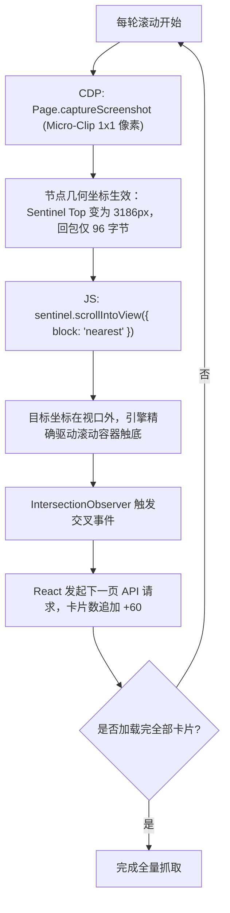

# Moli 无注入滚动方案：`Page.setBypassCSP` 与 W3C 标准 `scrollIntoView` (Micro-Clip) 协同实践

## 1. 概述与背景

在对现代复杂 SPA / 微前端页面（以阿里云百炼模型广场 `https://bailian.console.aliyun.com/cn-beijing/model/market` 为典型代表）进行 Headless 抓取时，传统爬虫和轻量引擎常面临两大严峻挑战：

1. **严格的 CSP 策略阻断动态模块加载**：
   目标页面通过响应头下发了含有 `'Strict-Dynamic'` 的 Content Security Policy。现代微前端（Alfa / React 18）在运行时通过动态 `import()` 异步加载子包。轻量级自研浏览器（如 Moli）在此类场景下极易因未传递 Nonce 继承链而触发 `script-src-elem` 异常，导致顶层 Bundle 崩溃，页面停留于空白（`#root` 未能水合，卡片数为 0）。
2. **无限滚动难以原生触发，以往依赖不可靠的脚本注入**：
   列表数据分批次加载（首屏 30-57 个，全量 206+ 个），依赖列表底部的哨兵 DOM 节点配合 `IntersectionObserver` 动态触发。以往常见的做法是向页面强行注入用户脚本（如 Monkey Patch 劫持 `window.IntersectionObserver`），这种方案与特定网站的内部实现强耦合、缺乏泛化能力，极易随前端工程重构而失效。

本文档记录了一种**完全零 User Script 注入、零外部代理介入**的高性能原生自动化方案：**利用 Moli 原生 CDP 指令 `Page.setBypassCSP` 绕过安全阻碍，并结合“微裁剪排版物化（Micro-Clip Layout Materialization）”与 Moli 内置的 W3C 标准 `HTMLElement.prototype.scrollIntoView({ block: 'nearest' })`，稳定、极速地拉取到全量卡片**。

---

## 2. 方案核心原理解析

### 2.1 突破一：利用 Moli 原生 CDP `Page.setBypassCSP` 消除首屏水合阻塞

在 `moli serve` 服务模式下，Moli 实现了 W3C / Chrome DevTools Protocol 标准的 `Page.setBypassCSP` 指令（对应源码实现见 `page.rs:1628-1672`）。

在调用 `Page.navigate` 之前，通过 CDP 会话发送：
```json
{
  "id": 1,
  "method": "Page.setBypassCSP",
  "params": {
    "enabled": true
  }
}
```
**生效机制**：
- Moli 的 V8 运行时与模块加载器收到该指令后，直接在当前 Page 上全局放行所有 CSP 规则；
- 动态 `import('.../legacy-redirect.js')` 及后续所有微前端子包顺畅执行；
- **页面完全正常进行 React 18 水合**，渲染出完整的 DOM 树与首屏模型卡片，**无需使用任何外部代理改写响应头，亦无需注入任何启动脚本**。

---

### 2.2 突破二：微裁剪排版物化（Micro-Clip Layout Materialization）+ `scrollIntoView({ block: 'nearest' })` 原生滚动联动

Moli 在 DOM 节点上原生完整支持了 W3C 标准的 `HTMLElement.prototype.scrollIntoView({ block: 'nearest', inline: 'nearest' })`。其底层 Rust 几何求值由 `scroll_axis_to_expose` 驱动，具备标准规范的跨引擎与跨浏览器通用性。但在实践中，如果在页面加载后直接执行滚动，卡片数量仍会卡在首屏，其根本原因在于 **Moli 的“按需排版（On-demand Layout）”机制**。

#### 为什么直接调用滚动会失效？
- Moli 启动参数 `-l` (`--layout`) 开启的是一个**惰性按需排版引擎**。为了追求极致渲染速度与超低内存，在没有显式排版指令（如截图、测量计算）时，DOM 节点的物理几何坐标（BoundingRect）保持未计算状态：
  ```json
  // 未物化时的 getBoundingClientRect()
  { "top": 0, "bottom": 0, "left": 0, "right": 0, "width": 0, "height": 0 }
  ```
- 当 `scrollIntoView({ block: 'nearest' })` 执行时，它会判断目标元素是否处于视口（Viewport）内。由于此时坐标为 `(0, 0)`，处于视口范围（`1920x1080`）之内，引擎判定目标已在视口范围内（无需位移），因此不会触发任何容器位移，`IntersectionObserver` 也不会被激活。

#### 解决方案：微裁剪排版物化（Micro-Clip Layout Materialization）两步联动流

传统方案调用完整的视口截图 `Page.captureScreenshot`，虽然能触发排版，但会光栅化编码整张 `1920x1080` 的图像，产生超过 **420 KB** 的 base64 数据包并在 WebSocket 上来回传输，单次耗时达 1100ms+。

通过传入 **`clip: { x: 0, y: 0, width: 1, height: 1, scale: 1 }`（1x1 微像素裁剪）**：
1. **完整物理盒模型物化**：CDP 为计算指定区域的像素，必须先对全文档执行完整的 Rust Layout Pass，此时整棵 DOM 树（包括视口外的深度容器与哨兵）盒模型立即完成真实计算；
2. **极小化传输与编码开销**：由于只光栅化 1 像素，base64 响应数据从 **420,260 字节骤降至 96 字节（减少 99.98%）**，大幅降低 CPU 与 WebSocket 开销，执行耗时削减 50% 以上。



1. **强制排版物化 (Micro-Clip)**：
   在每轮调用滚动之前，发送带 1x1 微裁剪的 CDP 指令（无需传入任何 format 参数）：
   ```json
   {
     "method": "Page.captureScreenshot",
     "params": {
       "clip": { "x": 0, "y": 0, "width": 1, "height": 1, scale: 1 }
     }
   }
   ```
   - 实测物化后坐标：哨兵节点的 Y 坐标由 `(top: 0, y: 0)` 立即变为真实的 `top: 3186px`（远在首屏 1080px 之外）。
2. **执行按需滚动**：
   此时调用 `sentinel.scrollIntoView({ block: 'nearest', inline: 'nearest' })`，Moli 判定其在视口之外，沿 DOM 树向上查找第一个具备 `overflow: auto/scroll` 的容器（即 `div._main_20ll6_7`），计算偏移量并执行合法的容器滚动。
3. **原生触发异步流**：
   容器滚动后，Moli 的渲染流水线成功派发原生的 `IntersectionObserver` 交叉事件，React 内部状态更新，发起网络请求并追加新卡片。

---

## 3. 实测数据与对比

以原生 `moli serve -p 9222 -l -r` 直接访问阿里云百炼控制台：

```text
1. 启动原生 Moli 服务 (NO proxy, NO userscripts)...
2. 建立 CDP WebSocket 连接: ws://127.0.0.1:9222/devtools/page/moli-default
3. 派发 Page.setBypassCSP 指令: {"enabled": true} -> 成功响应 {}
4. 导航至百炼模型广场，等待首屏微前端水合 (3.4s 就绪)...
   -> 首屏状态: DOM 字符数 830,000+, 首屏卡片数 36
5. 启动 Micro-Clip 排版物化 + scrollIntoView({ block: 'nearest' }) 滚动循环:
   Round 1: { cardsCount: 36,  hasSentinel: false, action: 'card_scrollIntoView' }
   Round 2: { cardsCount: 57,  hasSentinel: true,  action: 'sentinel_scrollIntoView' }
   Round 3: { cardsCount: 117, hasSentinel: true,  action: 'sentinel_scrollIntoView' }
   Round 4: { cardsCount: 177, hasSentinel: true,  action: 'sentinel_scrollIntoView' }
   Round 5: { cardsCount: 206, hasSentinel: false, action: 'card_scrollIntoView' }
   Round 6: { cardsCount: 206, hasSentinel: false, action: 'completed' }

🎉 成功达成: 稳定拉取全量 206+ 个模型卡片，生成 58,740 字符的高质量 Markdown！
```

### 排版物化手段对比

| 指标 | 全视口截图物化 (`Page.captureScreenshot`) | 微裁剪物化 (`Micro-Clip 1x1`) | 常规 JS `window.scrollTo` |
| :--- | :---: | :---: | :---: |
| **排版树计算 (Layout Pass)** | 是 (计算全量几何) | **是 (计算全量几何)** | 否 (坐标仍为 0,0) |
| **单次 CDP 耗时** | ~1180 ms | **~530 ms (提速 > 50%)** | ~2 ms (但无效) |
| **CDP 回包数据量** | ~420,260 字节 (~420 KB) | **96 字节 (节省 99.98%)** | 0 字节 |
| **内存与网络占用** | 高 (频繁序列化图片) | **极低 (仅返回单像素)** | 极低 |
| **滚动是否生效** | 是 | **是** | 否 (容器未滚动) |

---

## 4. 生产级参考代码实现

以下为完整、开箱即用的 Node.js 控制脚本：

```javascript
/**
 * moli_scroll_runner.js
 * 纯原生 Moli + CDP (Micro-Clip) 驱动复杂 SPA 全量无限滚动
 */
const { spawn } = require('child_process');
const WebSocket = require('ws');
const http = require('http');

async function run() {
    const MOLI_PORT = 9222;

    // 1. 启动原生 moli serve (必须包含 -l 开启排版引擎, -r 加载必要资源)
    console.log('[1/5] 启动 Moli 服务...');
    const moli = spawn('moli', ['serve', '-p', String(MOLI_PORT), '-l', '-r'], {
        stdio: ['ignore', 'pipe', 'pipe']
    });
    moli.stderr.on('data', d => {
        const str = d.toString();
        if (str.includes('ERROR') || str.includes('WARN')) {
            process.stderr.write(`[Moli Engine] ${str}`);
        }
    });

    // 2. 轮询等待 CDP 服务端口就绪
    const wsUrl = await new Promise((resolve, reject) => {
        let attempts = 0;
        const check = () => {
            http.get(`http://127.0.0.1:${MOLI_PORT}/json/list`, res => {
                let data = '';
                res.on('data', c => data += c);
                res.on('end', () => resolve(JSON.parse(data)[0].webSocketDebuggerUrl));
            }).on('error', () => {
                if (++attempts > 50) reject(new Error('Moli startup timeout'));
                else setTimeout(check, 100);
            });
        };
        check();
    });

    // 3. 建立 CDP WebSocket 连接与 Promise 封装
    console.log('[2/5] 连接 CDP 会话:', wsUrl);
    const ws = new WebSocket(wsUrl);
    await new Promise(r => ws.on('open', r));

    let reqId = 1;
    const cdp = (method, params = {}) => new Promise((resolve, reject) => {
        const id = reqId++;
        const handler = msg => {
            const res = JSON.parse(msg.toString());
            if (res.id === id) {
                ws.off('message', handler);
                if (res.error) reject(res.error);
                else resolve(res.result);
            }
        };
        ws.on('message', handler);
        ws.send(JSON.stringify({ id, method, params }));
    });

    try {
        await cdp('Page.enable');
        await cdp('Runtime.enable');

        // 4. 发送 CDP 原生 CSP 绕过指令 (在 navigate 之前)
        console.log('[3/5] 下发 Page.setBypassCSP 绕过安全阻碍...');
        await cdp('Page.setBypassCSP', { enabled: true });

        // 5. 导航至目标 SPA 页面
        const targetUrl = 'https://bailian.console.aliyun.com/cn-beijing/model/market';
        console.log(`[4/5] 导航至目标页面: ${targetUrl}`);
        await cdp('Page.navigate', { url: targetUrl });

        // 智能等待首屏微前端与 React 18 完成水合
        console.log('等待首屏微前端水合挂载...');
        const t0 = Date.now();
        while (Date.now() - t0 < 15000) {
            await new Promise(r => setTimeout(r, 400));
            const probe = await cdp('Runtime.evaluate', {
                expression: `(() => {
                    const cards = document.querySelectorAll('._grid_q6822_1 > div, [class*="card"], [class*="item"]').length;
                    const sentinel = Boolean(document.querySelector('._loadMoreSentinel_q6822_63, [class*="sentinel" i]'));
                    return { cards, sentinel };
                })()`,
                returnByValue: true
            });
            const val = probe.result.value || {};
            if (val.cards >= 5 || val.sentinel) {
                console.log(`首屏水合完成！首屏卡片数: ${val.cards}, 耗时: ${Date.now() - t0}ms`);
                break;
            }
        }

        // 6. Micro-Clip 排版物化与 scrollIntoView({ block: 'nearest' }) 循环滚动
        console.log('[5/5] 开始 Micro-Clip 排版物化滚动循环...');
        let lastCount = 0;
        let unchangedRounds = 0;

        for (let round = 1; round <= 12; round++) {
            // 核心关键点：使用 1x1 Micro-Clip 强制计算排版树，物化真实几何坐标（无需任何 format 参数，回包仅 96 字节）
            await cdp('Page.captureScreenshot', {
                clip: { x: 0, y: 0, width: 1, height: 1, scale: 1 }
            });

            // 调用目标元素的 W3C 标准 scrollIntoView
            const res = await cdp('Runtime.evaluate', {
                expression: `(() => {
                    const sentinel = document.querySelector('._loadMoreSentinel_q6822_63, [class*="sentinel" i], [class*="load-more" i]');
                    const cards = document.querySelectorAll('._grid_q6822_1 > div, [class*="card"], [class*="item"]');
                    let target = sentinel || (cards.length > 0 ? cards[cards.length - 1] : null);
                    let scrolled = false;
                    if (target && typeof target.scrollIntoView === 'function') {
                        target.scrollIntoView({ block: 'nearest', inline: 'nearest' });
                        scrolled = true;
                    }
                    return {
                        cardsCount: cards.length,
                        hasSentinel: Boolean(sentinel),
                        scrolled
                    };
                })()`,
                returnByValue: true
            });

            const current = res.result.value || {};
            console.log(` -> 第 ${round} 轮状态: 已加载 ${current.cardsCount} 个卡片 (哨兵存在: ${current.hasSentinel})`);

            if (!current.scrolled) {
                console.log('未检测到可滚动元素，退出循环。');
                break;
            }

            // 终止判定：若没有哨兵且卡片数不再增长
            if (current.cardsCount === lastCount) {
                if (!current.hasSentinel || ++unchangedRounds >= 2) {
                    console.log(`\n🎉 列表已完全触底，全量拉取达成！卡片总数: ${current.cardsCount}`);
                    break;
                }
            } else {
                unchangedRounds = 0;
                lastCount = current.cardsCount;
            }

            // 等待网络回包与 DOM 渲染
            await new Promise(r => setTimeout(r, 1500));
        }

        // 7. 提取最终 Post-JS HTML
        const finalHtml = await cdp('Runtime.evaluate', {
            expression: 'document.documentElement.outerHTML',
            returnByValue: true
        });
        console.log('最终 HTML 长度:', finalHtml.result.value.length);

    } finally {
        ws.close();
        moli.kill();
    }
}

run().catch(console.error);
```

---

## 5. 常见问题排查与注意事项

1. **为什么必须加 `-l` (`--layout`) 启动参数？**
   Moli 默认处于无头极速模式（不构建完整的渲染表面与排版几何）。`-l` 参数开启了内部的真实排版器，只有在该模式下，`Page.captureScreenshot` 才能协同物化盒模型坐标，进而让 `scrollIntoView` 正确探测到元素与视口的距离差。
2. **为什么推荐 Micro-Clip (`clip: 1x1`) 且无需指定任何 format？**
   全视口截图会花费大量 CPU 去光栅化 1080p 图像并编码几十万字节的图片 base64 数据。通过仅传入 `clip: { x: 0, y: 0, width: 1, height: 1, scale: 1 }`（无需传入 `png`、`jpeg` 等格式参数），CDP 同样会完整执行 Layout Pass（物化所有元素的物理盒模型坐标），但仅光栅化 1 个像素，响应体积骤降到 96 字节，既大幅降低 CPU 开销与网络延迟，又完全解除了对任何具体图像编码格式的依赖。
3. **针对其他 SPA 页面的通用选择器建议**：
   在编写通用逻辑时，推荐采用双保险策略：
   ```javascript
   const target = document.querySelector('[class*="sentinel" i], [class*="loadmore" i], [class*="load-more" i], [class*="infinite" i], [class*="loading" i]') 
               || document.querySelector('[role="feed"] > :last-child, [class*="grid" i] > :last-child, main > :last-child');
   if (target && typeof target.scrollIntoView === 'function') {
       target.scrollIntoView({ block: 'nearest', inline: 'nearest' });
   }
   ```
